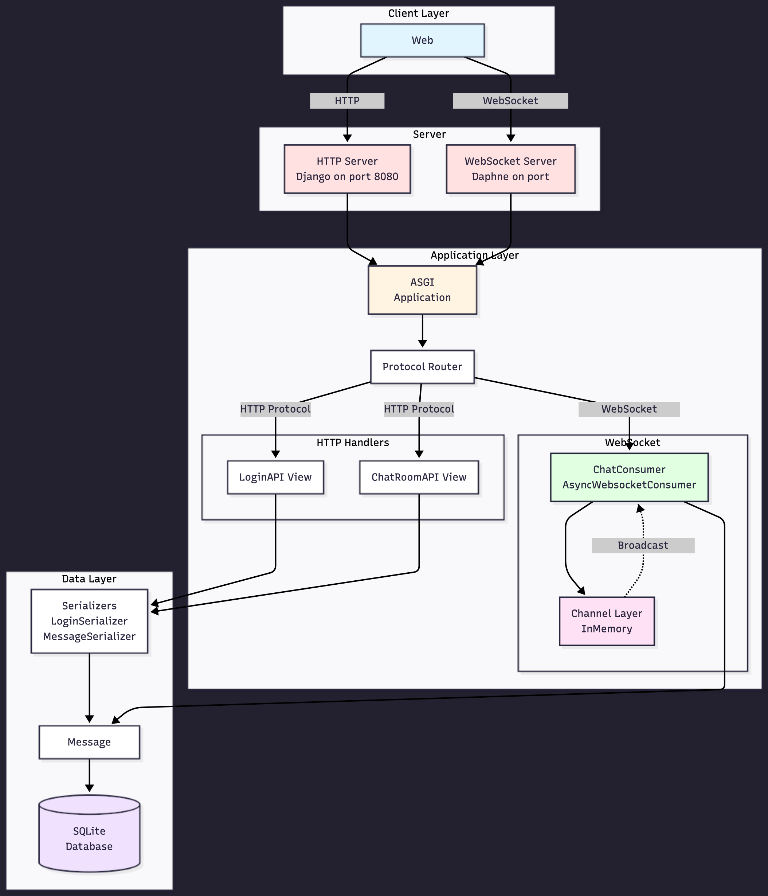

# ChatRoom Application

## Tech Stack
- Python 3.12
- Django
- Sqlite
- Channel
- Web Socket

## System Design

<div align="center">
  
</div>

The diagram above illustrates the complete architecture of the ChatRoom application, showing the flow between clients, servers, application layer, and data layer.

> **Note:** If the diagram doesn't display in your markdown viewer, you can open the [systemdesign.png](./systemdesign.png) file directly.

## Setup Instructions


### Local Development

1. **Clone and setup:**
   ```bash
   git clone https://github.com/priyanshupardhi/chatroom.git
   cd chatroom
   ```

2. Activate python environment

```BASH
   python3 -m venv venv
   source venv/bin/activate
   ```

3. Install neccessary requiremnts packages

```BASH
   pip install -r requirements.txt
   ```

4. Run Migrate models
```BASH
   python3 manage.py migrate
   ```

5. Run Django app

```BASH
   python3 manage.py runserver 0:8080
   ```

6. Run WebSocket

```BASH
   daphne chatroom.asgi:application
   ```


## API Documentation

### Base URL
- **Local**: `http://localhost:8080` for HTTP connection
- **Local**: `ws://localhost:8000` for WebSocket connection

### Endpoints

#### 1. Login API
```http
GET /chat/login
```
**Response:**
```json
{
  "Successfully Logged In"
}
```


#### 2. ChatRoom API
```http
GET /chat/room
```
**Response:**
```json
{
    "id": 1,
    "room_name": "general",
    "username": "Guest",
    "message": "Hello everyone!",
    "timestamp": "2025-10-28T08:54:24.053093Z"
}
```

#### Web Socket
```
ws://localhost:8000/ws/chat/general/
```

**Message Body:**
```json
{
"username": "jhon",
"message": "Hello everyone!",
"timestamp": "2025-06-24T11:30:00Z"
}
```